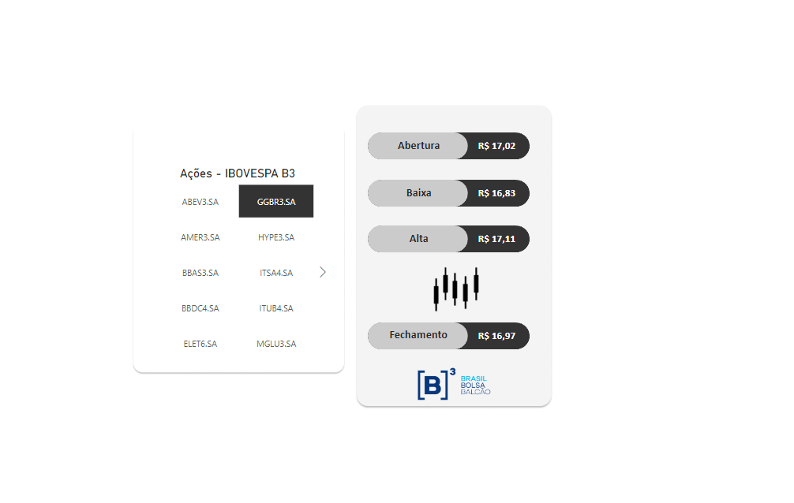

# FinanceTracker

**FinanceTracker** é um projeto desenvolvido para consultar e atualizar dados financeiros de ações da bolsa de valores brasileira (B3), utilizando a API do Yahoo Finance (yfinance). O objetivo do projeto é coletar informações sobre ações, como valores de abertura, baixa, alta e fechamento, e gerar um arquivo Excel com esses dados atualizados. O script também é configurado para realizar a atualização automática dos dados a cada 5 minutos.

Esses dados são utilizados no **Power BI** para alimentar dashboards interativos, permitindo a visualização e análise detalhada do comportamento das ações de forma dinâmica.



## Funcionalidades

- **Consulta de Ações**: O projeto consulta dados financeiros de diversas ações e exibe informações como valores de abertura, baixa, alta e fechamento.
- **Atualização Periódica**: Os dados das ações são atualizados automaticamente a cada 5 minutos.
- **Exportação para Excel**: Os dados consultados são exportados para um arquivo Excel chamado `dados.xlsx`.
- **Integração com Power BI**: O arquivo Excel gerado é utilizado no **Power BI** para criar dashboards interativos e realizar a análise dos dados financeiros.
- **Dashboard**: O projeto já está sendo utilizado no Power BI, onde você pode monitorar o comportamento das ações e criar visualizações dinâmicas.

## Estrutura do Projeto

- `consulta.py`: Arquivo que contém a lógica para consultar os dados financeiros das ações.
- `main.py`: Arquivo principal que executa a atualização periódica dos dados e gera o arquivo Excel.
- `dados.xlsx`: Arquivo Excel gerado com os dados atualizados das ações.

## Tecnologias Utilizadas

  

- **Python 3.x**: Linguagem de programação utilizada para consulta e manipulação dos dados.
- **yfinance**: Biblioteca que permite consultar dados financeiros de ações diretamente do Yahoo Finance.
- **pandas**: Biblioteca para manipulação de dados e criação do arquivo Excel.
- **Excel**: Formato utilizado para armazenar os dados financeiros das ações.
- **Power BI**: Ferramenta de visualização de dados para criar dashboards interativos e analisar os dados financeiros.

## Instalação

1. Clone o repositório para o seu computador:

   ```bash
   git clone https://github.com/seu_usuario/FinanceTracker.git
   
2. Instale as dependências necessárias:

   ```bash
   pip install yfinance pandas openpyxl

3. Execute o script main.py:
   
   ```bash
   python main.py

Isso iniciará o processo de coleta de dados, que será realizado a cada 5 minutos.

4. Os dados serão salvos no arquivo dados.xlsx.

5. Importe os dados gerados para o Power BI para visualização.

<h2>Contribuições</h2>
Sinta-se à vontade para contribuir para o projeto! Se encontrar algum problema ou tiver sugestões, abra uma issue ou envie um pull request

<h2>Contato 💼</h2>

**E-mail:** felipesantoss.dev@outlook.com
